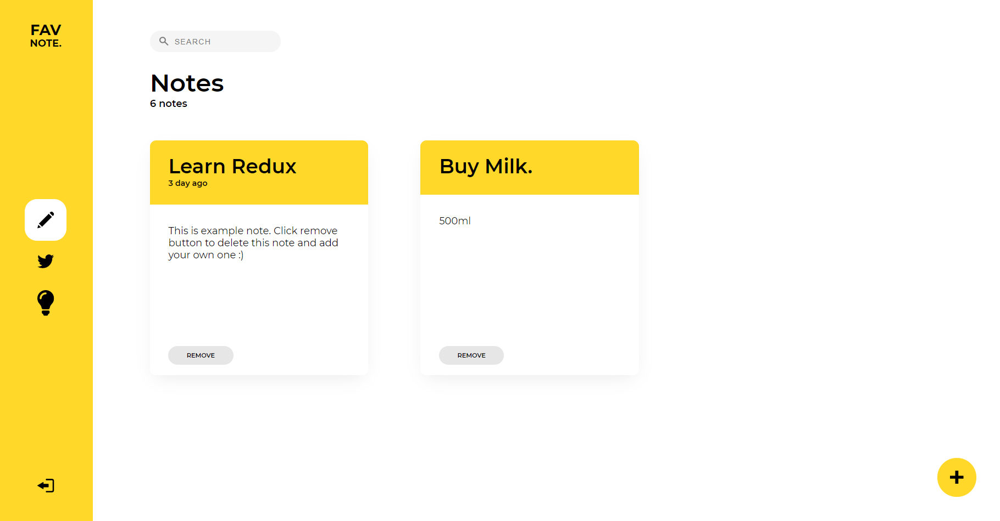
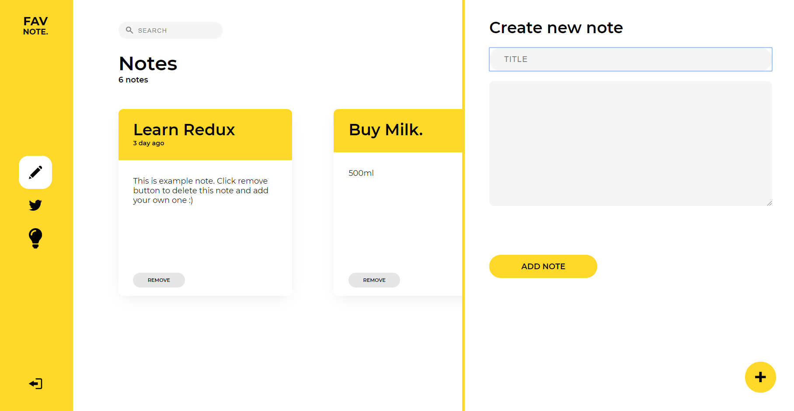
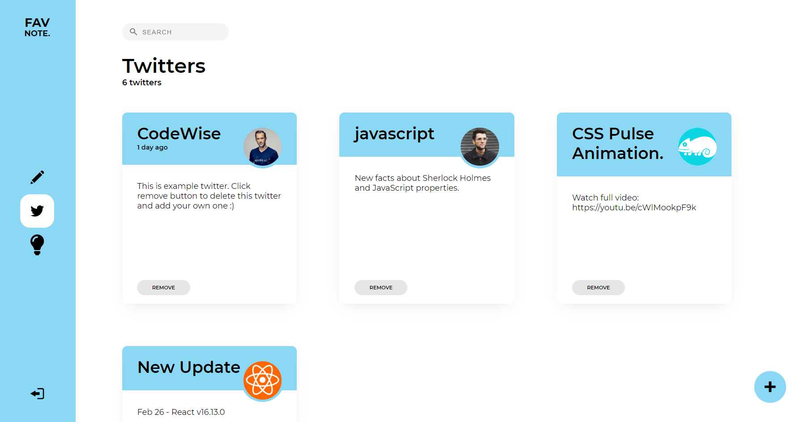
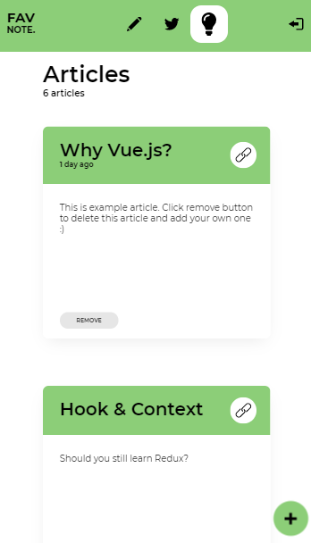
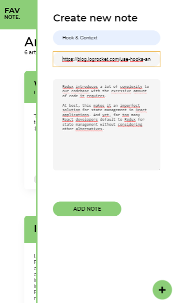

## DEMO
https://favoritenotes.netlify.app/login
## Project title 
FavNote.

## Technolgies 
React.js | Redux | Context | React-Router | UUID | Styled-Component | Formik | Storybook.js | HOC

## App description
User have 3 possible views to move around - notes, twitters and aricles. In all views user can add, remove and also see details of each item by clicking on it. 
## Todo
App is not deployed yet couse its still in progres.
Incoming features: 
-backend (User will need to be log in so the items in each view will be stored in memory after exiting/refreshing app)
-search form
-better form validations 

## Screenshots

